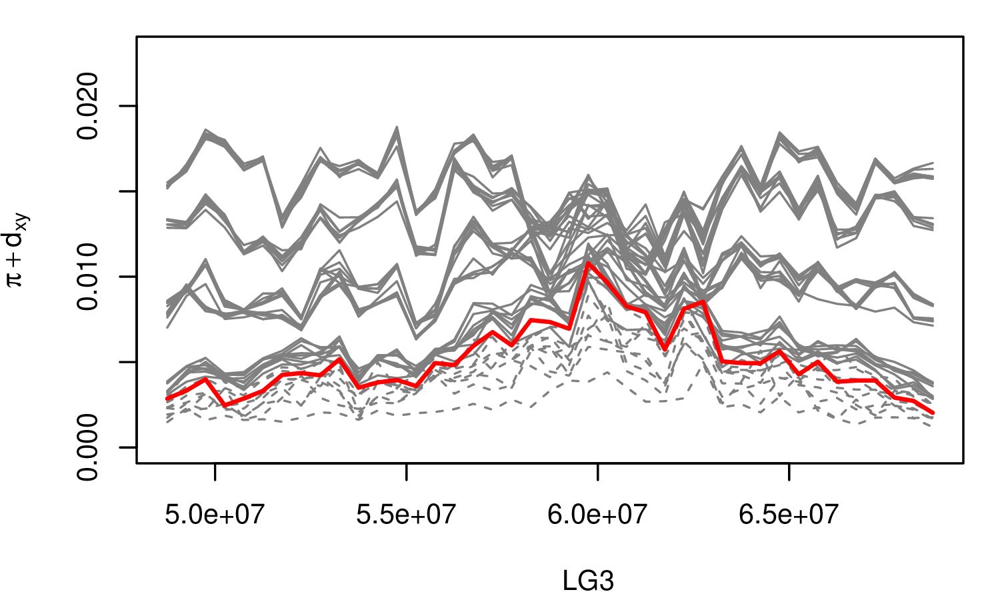
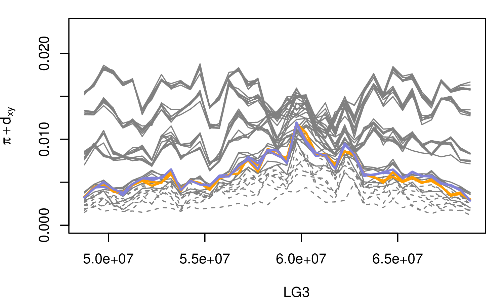
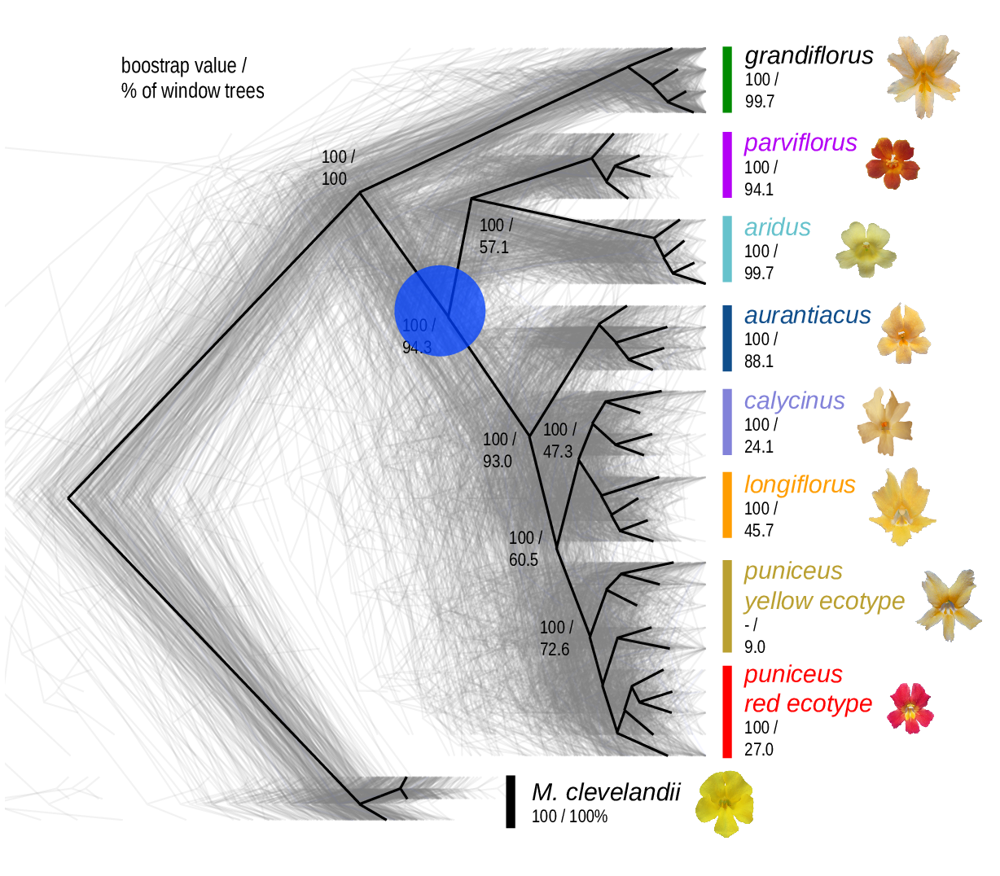

# Genomic landscapes

##

<!--
## *Homo sapiens*

*Hernandez et al 2011*
-->

## Diversity correlates with recombination rate

Corbett-Detig et al 2015; Cutter & Payseur 2013 

--------------------

{width=70%}

Corbett-Detig et al 2015

<!--
-------------------

McVicker et al 2009
-->

##

What causes variation in genetic diversity?

##

$$
\begin{aligned}
\pi &= \text{ (within-pop diversity) } \\
d_{xy} &= \text{ (between-pop divergence) } \\
F_{ST} &= \text{ (relative differentiation) }
\end{aligned}
$$

::: {.centered}

{width=60%}

:::

<!-- section THEORY -->

# Linked selection, in theory

--------------

linked selection

: The indirect effects of selection on genomic locations
  that are *linked* to the sites under selection by a lack of recombination.

::: {.centered}

{.fragment width="40%"}
{.fragment width="40%"}

:::

--------------------

**Linked Selection: a field guide**

*composed of rough sketches*

. . .

*citations: numerous*

0. Neutrality
-------------

0. Neutrality
-------------

1. A "hard" sweep
-----------------

2. A "soft" sweep
-----------------

3. Adaptive introgression
-------------------------

4. Local adaptation with gene flow
-------------------

<!-- [Bierne 2010](https://doi.org/10.1111%2fj.1558-5646.2010.01050.x) -->

5. Background selection
-----------------------

6. Recurrent sweeps
-------------------

7. Recurrent introgression
--------------------------

## Etcetera

8. Recent balanching selection

9. Long-term balancing selection

10. Recurrent local adaptation after a split

11. Recurrent, transient balancing selection

12. All of the above?

<!-- AURENTIACUS -->

# How do genetic landscapes change over time?

The *Mimulus aurantiacus* species complex
-----------------------------------------

::: {.centered}

:::

------------------

::: {.centered}
{width=70%}
:::

----------------------------------

----------------------------------

-------------------------

The data:

- chromosome-level genome assembly
- $20\times$ coverage of 8 taxa and outgroup (*M.clevelandii*)
- diversity ($\pi$) and divergence ($d_{xy}$) in windows
- 36 pairwise comparisons among 9 taxa
- estimates of recombination rate and gene density
    from map and annotation

<!--
## A spectrum of differentiation

-->

# Landscapes of bush monkeyflower

-------------------

::: {.centered}
{ width="46%" }
{ width="47%" }
:::

-------------------

::: {.centered}
{ width="47%" }
{ width="46%" }
:::

-------------------

::: {.centered}
{ width="60%" }
:::

---------------------

<!--

-->

:::: {.columns}
:::::::: {.column width=80%}

::::
:::::::: {.column width=20%}

{width="250%"}

::::
::::::::

---------------------

:::: {.columns}
:::::::: {.column width=80%}

::::
:::::::: {.column width=20%}

{width="250%"}

::::
::::::::

---------------------

:::: {.columns}
:::::::: {.column width=80%}

::::
:::::::: {.column width=20%}

{width="250%"}

::::
::::::::

---------------------

:::: {.columns}
:::::::: {.column width=80%}

::::
:::::::: {.column width=20%}

{width="250%"}

::::
::::::::

<!--
---------------------

:::: {.columns}
:::::::: {.column width=80%}

::::
:::::::: {.column width=20%}

{width="250%"}

::::
::::::::
-->

---------------------

:::: {.columns}
:::::::: {.column width=80%}

::::
:::::::: {.column width=20%}

{width="250%"}

::::
::::::::

---------------------

:::: {.columns}
:::::::: {.column width=80%}

::::
:::::::: {.column width=20%}

{width="250%"}

::::
::::::::

---------------------

:::: {.columns}
:::::::: {.column width=80%}

::::
:::::::: {.column width=20%}

{width="250%"}

::::
::::::::

--------------------

# Conclusions

## Observations

> 1. $d_{xy}$ is similar but not the same for different pairs of taxa separated by the same node in the phylogeny.
> 
>     - {.finger width="15%"} some early introgression
> 
> 2. At first, $d_{xy}$ is like $\pi$ but shifted up.
> 
>     - {.finger width="15%"}  good.
> 
> 3. But then $d_{xy}$ starts to flatten out.
> 
>     - {.finger width="15%"}  increased *fixation* rate due to positive mutation?
>     - or, something about repeats?

##

- Evolution of the landscape of diversity across $\approx$ 1.5 million years!

- Shared targets of linked selection across taxa?

. . .

- But, what *kind* of linked selection? \
    How strongly and frequently does it act? \
    On how many targets?

. . .

Consequences for: genetic load/disease,
speed of evolution,
trait architecture.

# Network drift

## 

:::: {.columns}
:::::::: {.column width=50%}

The data suggest **lots** of selection.

What kind? Is this plausible?

{.finger width="15%"}
We need explicit models.

::::
:::::::: {.column width=50%}

Josh Schiffman

::::
::::::::

## 

::: {.columns}
::::::: {.column width="50%"}

At time $t$,

$\kappa(t)$ : internal state \
    ($n$-vector of expression levels)

$\phi(t)$ : $k$-vector of phenotype

$u(t)$ : $\ell$-vector of input signals

:::
::::::: {.column width="50%"}

$$\begin{aligned}
    \dot \kappa(t) &= A \kappa(t) + B u(t) \\
    \phi(t) &= C \kappa(t) 
\end{aligned}$$

where

$A$ : $n \times n$ matrix of interactions

$B$ : $n \times \ell$ input to internal state

$C$ : $k \times n$ internal state to output

:::
:::::::

## 

If $\phi(0) = 0$,
$$\begin{aligned}
    \phi(t) = \int_0^t  h(t-s) u(s) ds .
\end{aligned}$$
where
$$\begin{aligned}
    h(s) = C e^{sA} B
\end{aligned}$$

## Are systems unique?

How many *systems* $(A, B, C)$
have the *same* input-output behavior,
$$\begin{aligned}
    u \mapsto \phi,
\end{aligned}$$
if any?

. . .

Answer: generically, **lots** (Kalman 1963).

## Example: two-gene oscillator

:::: {.columns}
:::::::: {.column width="50%"}

$$\begin{aligned}
    A &= \begin{bmatrix}
    0 & 1 \\
    -1 & 0
    \end{bmatrix} \\
    B &= \begin{bmatrix}
    1 \\ 1 \end{bmatrix} \\
    C &= \begin{bmatrix}
    1 & 0 \end{bmatrix}
\end{aligned}$$

{ width="80%" }

::::
:::::::: {.column width=50%}

{ width="70%" }

::::
::::::::

## Example: two-gene oscillator

:::: {.columns}
:::::::: {.column width="50%"}

$$\begin{aligned}
    A &= \begin{bmatrix}
    1 + \frac{1}{\tau - 1} & 2 \tau + \frac{1}{\tau - 1} \\
    \frac{-1}{\tau - 1} & - 1 - \frac{1}{\tau - 1}
    \end{bmatrix} \\
    B &= \begin{bmatrix}
    1 \\ 1 \end{bmatrix} \\
    C &= \begin{bmatrix}
    1 & 0 \end{bmatrix}
\end{aligned}$$

::::
:::::::: {.column width=50%}

::::
::::::::

## Example: two-gene oscillator

::: {.centered}
{width="70%"}
:::

## Consequences for speciation?

::: {.centered}
{width="100%"}
:::

# Summary

-------

> - Landscapes of genetic diversity are clues to the ongoing types and intensities
    of natural selection.

> - We can see them emerge, and change with time.

> - What makes these landscapes? Still unknown.

> - Explicit models can provide surprising predictions.

Thanks!
-------

Mimulus: Madeline Chase, Sean Stankowski, Matt Streisfeld, Murillo Rodrigues

Other: Josh Schiffman, Sergey Nuzhdin, Andy Kern

Funding: NSF ABI, Sloan, UO

Slides with [reveal.js](http://hakim.se) and [pandoc](https://pandoc.org/).

<!-- MISCELLANEA -->

##

miscellanea

Hitchhiking
-----------

Background selection
--------------------

Balanced polymorphism
---------------------

3. Recent balancing selection
----------------------

4. Long-term balancing selection
----------------------

## *Drosophila melanogaster*

---------------------

------------------

{width=70%}
